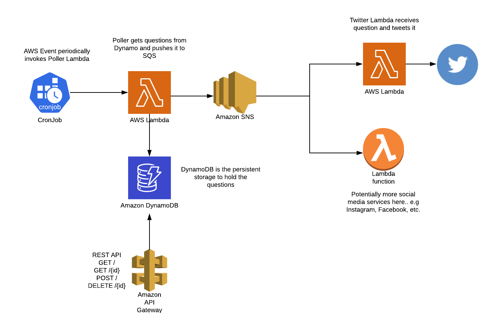

# BigTalk

inspired by [https://www.makebigtalk.com/](https://www.makebigtalk.com/)

This is intended to be a fully serverless application running on AWS.
The goal of this project was to teach myself a bit more about cloud native, AWS, serverless, etc

Tools used:
* Go (running on AWS Lambdas)
* DynamoDB (for storing data)
* Cloudformation (for managing cloud resources)
* API Gateway (for a RESTful API)
* Twitter API (for posting to Twitter)
* Instagram API (for posting to Instagram)
* AWS SAM / S3 / IAM for ops stuff

why?
social media is often filled with negative content. if you're gonna be scrolling through instagram or twitter, here is some content that you may find helpful in connecting with people, or understanding yourself better.

## High Level Architecture

[View Lucid Chart file here..](https://www.lucidchart.com/documents/edit/2306ed36-223d-4cb3-9f49-2db0689fbf41)

To Run:
1. Build lambdas using `build/make_functions.sh`
2. Run pipeline tool which uploads lambdas and cloudformation stack to AWS
    ` go run build/pipeline.go --path target/artifact/resources/ -cf-directory cloudformation.template`
    
   This assumes that a versioned bucket is already created to hold the resources
   see `pipeline help` for more information
   
   
Things to Add:
1. Support for first time stack upload of CF stack
2. Finish REST API (GET / DELETE)

View results [here](https://twitter.com/createbigtalk)

 